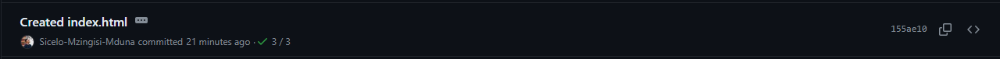
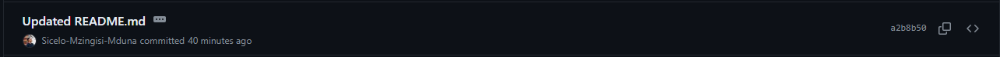
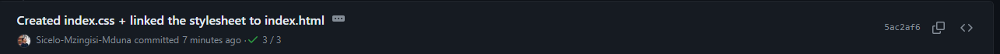

# Sicelo-Mzingisi-Mduna.github.io
Professional GitHub Portfolio

## Project Website URL:
https://sicelo-mzingisi-mduna.github.io/

## Brief Description
* This is a simple Website to showcase my skills, cv, and personal projects
* I will initially create this website using HTML, CSS + JavaScript
* At a later stage i want to incorporate Bootstrapping and other modern Web design frameworks so that the website is responsive for all devices and respective screen sizes. 

## (Date Modified  : 2024 / 02 / 14 - 21:55)
---------------------------------------------------------------------------------------------------
## Document all the changes made to the main branch for debugging purposes

----------------------------------------------------------------------------------------------------

# Modification Date: 2024 / 02 / 14

* 1) __Created index.html__
 

* 2) __Updated README.md__

* 3) __Created index.css + linked the stylesheet to index.html__

